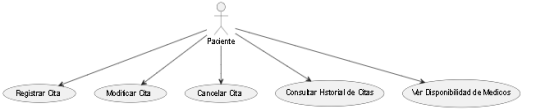

# SISTEMA DE GESTIÓN DE CITAS MÉDICAS

## CONTENIDO

FICHA DEL DOCUMENTO

* 1.INTRODUCCIÓN 
- 1.1.Propósito
- 1.2.Alcance
- 1.3.Personal involucrado
- 1.4.Acrónimos y abreviaturas
- 1.5.Referencias
- 1.6.Visión general
* 2.DESCRIPCIÓN GENERAL
- 2.1.Perspectiva del producto
- 2.2.Funcionalidades del producto
- 2.3.Características de los usuarios
- 2.4.Restricciones 
- 2.5.Suposiciones y dependencias 
* 3.REQUISITOS ESPECÍFICOS
- 3.1.Interfaces externas
- 3.1.1.Interfaces de usuario
- 3.1.2.Interfaces de hardware
- 3.1.3.Interfaces de software
- 3.1.4.Interfaces de comunicación
* 3.2.Requerimientos funcionales
- RF1: Gestión de citas
- RF2: Gestión de pacientes
- RF3: Gestión de médicos
- RF4: Facturación y pagos
- RF5: Reportes y estadísticas
- RF6: Notificaciones
* 3.3.Requerimientos no funcionale
- RNF1: Requisitos de rendimiento
- RNF2: Requisitos de diseño
- RNF3: Requisitos de calidad
- RNF4: Restricciones
* 4.Diagramas UML
- 4.1.Diagrama de casos de uso
- 4.2.Diagrama de clases
- 4.3.Diagrama de secuencia
* 5.Plan de desarrollo
- 5.1.Configuración del entorno de desarrollo
- 5.2.Configuración del proyecto
* 6. Mockup
- 7.Bibliografía

# Especificación de Requisitos de Software para un Sistema de Gestión de Citas Médicas 

## 1.INTRODUCCION

### 1.1.Propósito
Este documento describe los requisitos para desarrollar un sistema de gestión de citas para una clínica médica. El objetivo es proporcionar un sistema eficiente para gestionar citas, datos de pacientes y médicos, facturación y notificaciones, proporcionando una mejor experiencia de usuario y operaciones clínicas.

### 1.2.Alcance
Este sistema permitirá a los pacientes reservar, cambiar y cancelar citas, mientras que los médicos podrán gestionar sus horarios y perfiles de pacientes. Además, el sistema incluirá funciones de facturación, informes y notificaciones automatizadas.

### 1.3.Personal involucrado

| Nombre                          | Rol                        | Categoría Profesional       | Responsabilidades          |
|---------------------------------|----------------------------|-----------------------------|----------------------------|
| Ximena del Pilar Zambrano Chala | Diseñadora y Programadora  | Ingeniería de Sistemas      | Desarrollo del Frontend    |
| Juan Camilo Penagos Molina      | Programador                | Ingeniería de Sistemas      | Desarrollo del Backend     |

### 1.4.Acrónimos y abreviaturas
- SGC: Sistema de Gestión de Citas
- HCE: Historia Clínica Electrónica
- UI: Interfaz de Usuario
- DBMS: Sistema de Gestión de Base de Datos

### 1.5.Referencias

| Referencia                                   | Título                       | Descripción                                                     |
|----------------------------------------------|------------------------------|-----------------------------------------------------------------|
| IEEE-830                                     | IEEE Std 830-1998            | Práctica para la especificación de requerimientos del software  |
| HIPAA (Health Insurance Portability and Accountability Act) | Ley de Transferencia y Responsabilidad de Seguro Médico | Para normativas de seguridad y privacidad                                     |

### 1.6. Visión general

El documento está dividido en secciones que describen la funcionalidad del sistema, las necesidades del usuario, los requisitos del sistema y las restricciones de diseño.

# 2. DESCRIPCIÓN GENERAL
### 2.1.Perspectiva del producto

El SGC es una aplicación cliente-servidor basada en la web. El paciente podrá consultar o pedir citas médicas , así como cancelar las mismas por medio del sistema de gestión de citas. También podrá ver facturas de cada cita que haya tenido y su historial médico. Por otro lado, el médico podrá registrar y actualizar las citas médicas asignadas y horarios de trabajo.

### 2.2.Funcionalidades del producto

El sistema estará compuesto de los siguientes módulos:

- Gestión de citas: Crear, modificar y cancelar citas.
- Gestión de pacientes: Registro, actualización y acceso a historiales.
- Gestión de médicos: Registro, actualización y gestión de horarios.
- Facturación y pagos: Generación de facturas y procesamiento de pagos.
- Reportes y estadísticas: Generación de reportes detallados.
- Notificaciones: Recordatorios automáticos de citas.

### 2.3.Características del usuario

| Tipo de Usuario  | Actividad                                                   |
|------------------|-------------------------------------------------------------|
| Pacientes        | Reservación y gestión de citas                              |
| Médicos          | Gestionan horarios y consultas de pacientes                 |
| Administradores  | Gestionan usuarios, configuración del sistema y reportes    |

### 2.4.Restricciones
- Cumplimiento con las normativas de protección de datos (HIPAA)
- Soporte multi-idioma y accesibilidad.
- Rendimiento: Tiempo de respuesta menor a  2 segundos por operación

### 2.5.Suposiciones y dependencias
- Trafico fluido de datos al momento de pedir citas o consultas medicas de varios usuarios.
- Los usuarios tienen acceso a dispositivos con conexión a Internet.
- La infraestructura de la clínica soporta el uso de aplicaciones web.

# 3.REQUISITOS ESPECÍFICOS

## 3.1.Interfaces externas
- Interfaces de usuario: Aplicación web responsiva.
- Interfaces de hardware: Servidores y dispositivos de red.
- Interfaces de software: Integración con pasarelas de pago y sistemas de notificación.
- Interfaces de comunicación: HTTPS para seguridad de la comunicación.

## 3.2.Requerimientos funcionales
## 3.2.1.RF1: Gestión de citas.
### Crear citas:
- Los usuarios pueden seleccionar un medico, fecha y hora disponibles.
- Validación de disponibilidad antes de la confirmación.

### Modificar citas:
- Los usuarios pueden cambiar la fecha, hora y médico de una cita.
- Notificación automática de cambios a los involucrados.  

### Cancelar citas:
- Opción para cancelar citas con notificación automática.
- Registro de cancelaciones en el historial del paciente.

### Ver Disponibilidad:
- Visualización de horarios disponibles por médico y especialidad. 

## 3.2.2. RF2: Gestión de pacientes.
### Registro y actualización:
- Formulario de registro con datos personales.
- Permitir actualización de información.

### Historial de citas:
- Acceso a un registro completo de citas pasadas y futuras.

## 3.2.3. RF3: Gestión de Médicos.
### Registro y actualización:
- Formulario para registrar nuevos médicos.
- Actualización de información profesional y horarios.

### Horarios de trabajo:
- Configuración y visualización de horarios disponibles.

## 3.2.4. RF4: Facturación y pagos
### Generación de facturas:
- Creación automática de facturas por servicios prestados.
- Envió de facturas por correo electrónico

### Procesamiento de pagos:
- Integración con pasarelas de pagos.
- Registro de pagos y estado de facturas. 

## 3.2.5. RF5 Reportes y Estadísticas
### Generación de reportes:
- Reportes de citas por médico, especialidad y fechas.
- Reportes de ingresos y facturación.

### Estadísticas:
- Análisis de patrones y tendencias de citas.

## 3.2.6. RF6: Notificaciones
### Recordatorios Automáticos:
- Envío de recordatorios por correo y SMS antes de las citas.
- Configuración de la frecuencia y horario de envío.

## 3.3.Requerimientos no funcionales
## 3.3.1.RNF1: Requisitos de rendimiento:
- Manejo de al menos 1000 usuarios concurrentes.
- Tiempo de respuesta inferior a 2 segundos para todas las operaciones.

## 3.3.2.RNF2: Requisitos de diseño.
### Arquitectura del sistema:
- Arquitectura cliente-servidor.
- Frontend en React.js y Backend en Node.js con Express.js.
- Base de datos PostgreSQL y MongoDB.

### Seguridad:
- Uso de HTTPS para todas las comunicaciones.
- Autenticación basada en JWT.
- Almacenamiento seguro de contraseñas con bcrypt.

## 3.3.3.RNF3: Requisitos de calidad.
### Usabilidad:
- Interfaz intuitiva y accesible.
- Soporte para múltiples dispositivos y navegadores.

### Mantenibilidad:
- Código modular y bien documentado.
- Uso de estándares de codificación y pruebas automatizadas.

## 3.3.4.RNF4: Restricciones.
### Legales:
- Cumplimiento con normativas de privacidad y protección de datos (HIPAA).

### Operacionales:
- Disponibilidad del sistema 24/7 con un tiempo de inactividad mínimo.

# 4.DIAGRAMAS UML
En esta sección del documento se anexan las estructuras de código de diagramas UML(Clases,Casos de Uso y de Secuencia) , estos diagramas muestran la estructura del software, de como esta compuesto y como puede interactuar el usuario con el sistema. 

## 4.1.Diagrama de casos de uso

## 4.2.Diagrama de clases

## 4.3.Diagrama de secuencia

 # 5.Plan de desarrollo

## 5.1.Configuración del entorno de desarrollo
### Frontend:
- React.js, HTML, CSS, JavaScript

### Backend:
- Node.js, Express.js, PostgreSQL, MongoDB

### Infraestructura:
- Servidor: Nginx
- Contenedores: Docker
- Orquestación: Kubernetes

## 5.2.Configuración del proyecto
- Clonar el repositorio del proyecto.
- Configurar variables de entorno (`.env`).
- Instalar dependencias de Node.js.

# 6. Mockup

# 7.Bibliografía

- IEEE Std 830-1998. IEEE Recommended Practice for Software Requirements Specifications. Institute of Electrical and Electronics Engineers, 1998.

- HIPAA. Health Insurance Portability and Accountability Act of 1996, U.S. Department of Health & Human Services.

